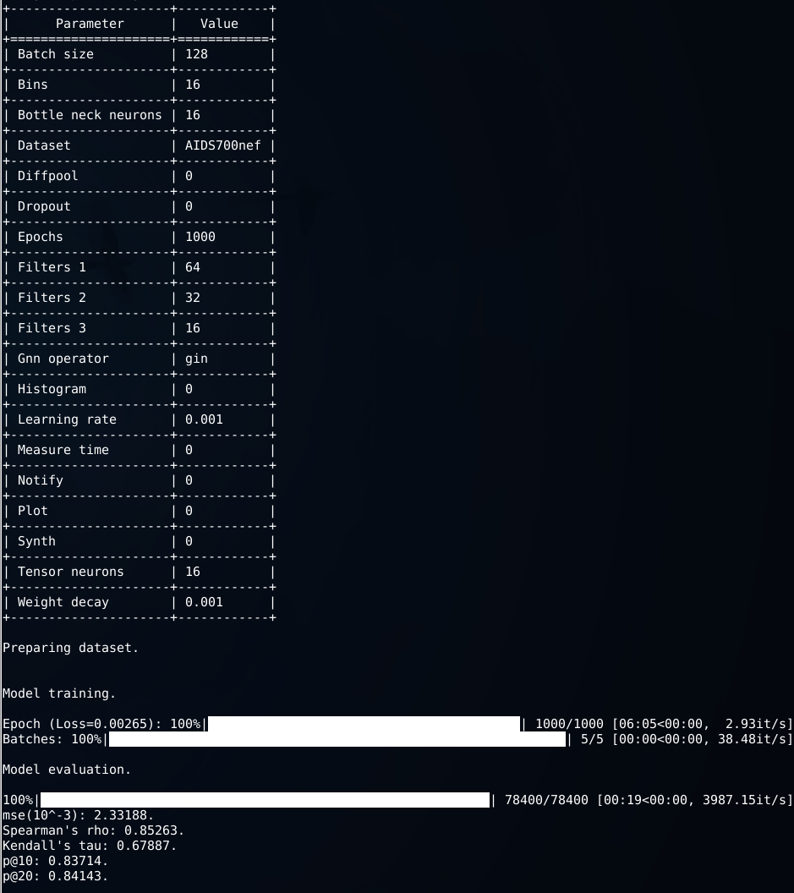

Extended SimGNN
============================================
A PyTorch Geometric implementation of "SimGNN: A Neural Network Approach to Fast Graph Similarity Computation" (WSDM 2019) [[Paper]](http://web.cs.ucla.edu/~yzsun/papers/2019_WSDM_SimGNN.pdf)
extended with Graph Isomorphism Operator from the [“How Powerful are Graph Neural Networks?”](https://arxiv.org/abs/1810.00826) paper
and Differentiable Pooling Operator from the ["Hierarchical Graph Representation Learning with Differentiable Pooling"](https://arxiv.org/abs/1806.08804) paper.  

This implementation was written and used to conduct experiments for my bachelor thesis "Approximating the Graph Edit Distance via Deep Learning" at the Technical University of Dortmund.  
The code in this repository can be changed and updated. The original code that was attached to my thesis can be viewed in the [initial commit](https://github.com/gospodima/Extended-SimGNN/tree/f7f10f032a7a78eac3f609790e50e7627b1de322).

The project structure is based on the PyTorch implementation [[benedekrozemberczki/SimGNN]](https://github.com/benedekrozemberczki/SimGNN).  
A reference Tensorflow implementation is accessible [[here]](https://github.com/yunshengb/SimGNN).


<p align="center">
  
</p>
<p align="justify">

### Requirements
The codebase is implemented in Python 3.5.2. package versions used for development are just below.
```
matplotlib        3.0.3
networkx          2.3
numpy             1.16.3
pandas            0.24.2
scikit-learn      0.21.1
scipy             1.3.0
texttable         1.6.1
torch             1.1.0
torch-cluster     1.4.0
torch-geometric   1.3.0
torch-scatter     1.2.0
torch-sparse      0.4.0
torchvision       0.2.2
tqdm              4.32.1
```
### Datasets
The datasets are taken with the help of [GEDDataset](https://pytorch-geometric.readthedocs.io/en/latest/modules/datasets.html#torch_geometric.datasets.GEDDataset),
where the databases specified in the [original repository](https://github.com/yunshengb/SimGNN) with GED-values are loaded. 
Currently AIDS700nef, LINUX, ALKANE and IMDBMulti databases are supported.

### Options
Training a SimGNN model is handled by the `src/main.py` script which provides the following command line arguments.

#### Input and output options
```
  --database    STR     Name of the dataset to be used.         Default is `AIDS700nef`.
  --plot        BOOL    Plot mse values during the learning.    Default is False.
```
#### Model options
```
  --diffpool              BOOL        Differentiable pooling.                  Default is False.
  --gnn-operator          STR         Type of gnn operator.                    Default is gcn.
  --filters-1             INT         Number of filter in 1st GNN layer.       Default is 64.
  --filters-2             INT         Number of filter in 2nd GNN layer.       Default is 32. 
  --filters-3             INT         Number of filter in 3rd GNN layer.       Default is 16.
  --tensor-neurons        INT         Neurons in tensor network layer.         Default is 16.
  --bottle-neck-neurons   INT         Bottle neck layer neurons.               Default is 16.
  --bins                  INT         Number of histogram bins.                Default is 16.
  --batch-size            INT         Number of pairs processed per batch.     Default is 128. 
  --epochs                INT         Number of SimGNN training epochs.        Default is 350.
  --dropout               FLOAT       Dropout rate.                            Default is 0.
  --learning-rate         FLOAT       Learning rate.                           Default is 0.001.
  --weight-decay          FLOAT       Weight decay.                            Default is 10^-5.
  --histogram             BOOL        Include histogram features.              Default is False.
```

#### Other options
```
  --synth           BOOL    Generate and add synth data to the samples.             Default is False.
  --measure-time    BOOL    Measure average calculation time for one graph pair.    Default is False.
```

### Examples
The following commands learn a neural network and score on the test set. Training a SimGNN model on the default dataset.
```
python src/main.py
```
<p align="center">

</p>

Training a SimGNN model for a 1000 epochs with a batch size of 512.
```
python src/main.py --epochs 1000 --batch-size 512
```
Training a SimGNN on the LINUX dataset with histogram features, GIN instead of GCN and DiffPool instead of attention mechanism from the paper.
```
python src/main.py --database LINUX --histogram --gnn-operator gin --diffpool
```
Drawing up a graphic of mse values during the learning.
```
python src/main.py --plot
```
Increasing the learning rate and the dropout.
```
python src/main.py --learning-rate 0.01 --dropout 0.9
```
